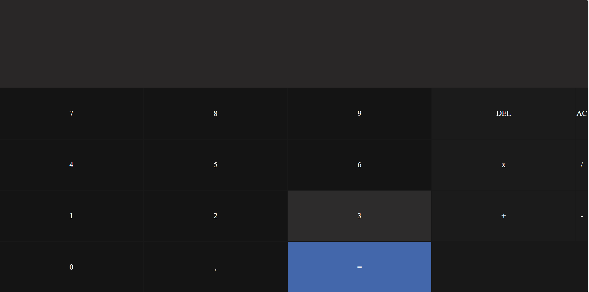
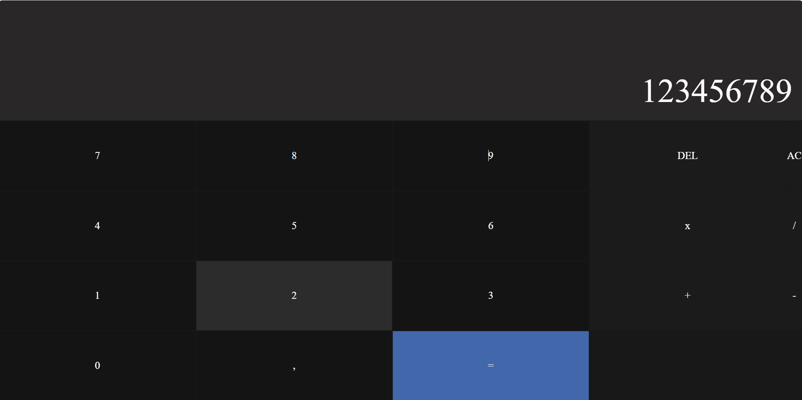
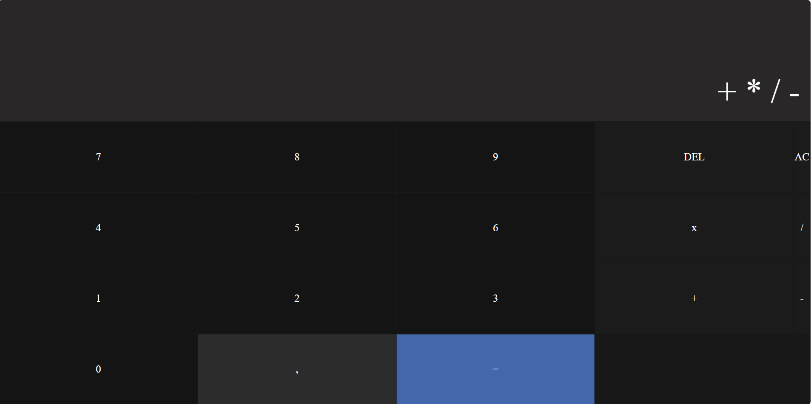

<<<<<<< HEAD
# Calculator Web App

A simple, stylish calculator built with HTML, CSS, and JavaScript.

---

## Features

- Basic arithmetic operations: addition, subtraction, multiplication, division
- Responsive and modern UI
- Keyboard and mouse support
- Clear (AC) and delete (DEL) functions

---

## Screenshots

<!-- Add your screenshots below this line -->

[Test Video](videoTest.mp4)

---

## Getting Started

### Prerequisites

- A modern web browser (Chrome, Firefox, Edge, etc.)

### Installation

1. Clone or download this repository.
2. Open `index2.html` in your browser.

---

## Usage

- Click the buttons to enter numbers and operations.
- Press `=` to calculate the result.
- Use `DEL` to delete the last character.
- Use `AC` to clear the entire input.

---

## Project Structure

- [`index2.html`](index2.html): Main HTML file
- [`style2.css`](style2.css): Stylesheet for the calculator
- `img1.png`: (Optional) Image asset

---

## Customization

You can modify the styles in [`style2.css`](style2.css) to change the appearance of the calculator.

---

## License

This project is open source and available under the [MIT License](LICENSE).

---

## Author

- Thierry Florent DZOUATO DJEUMEN
=======

>>>>>>> dca0bb232dcb5a16b1417a07c044f9f9024b7d77
